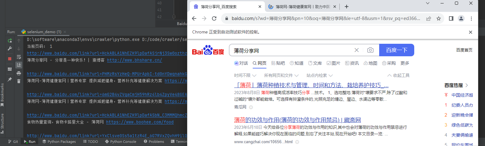
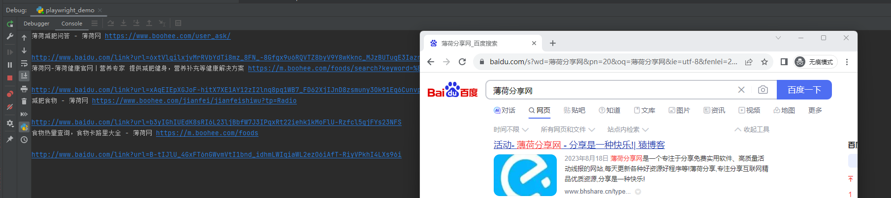

## crawler

一些爬虫自动化工具的简单使用..

(仅包含模拟浏览器的web自动化工具，requests+bs4可参考：[yaokui2018/picture_climb](https://github.com/yaokui2018/picture_climb/blob/master/spider.py))

###  环境依赖
`pip install -r requirements.txt`

### 1. selenium
Selenium是一个用于Web应用程序测试的工具。Selenium测试直接运行在浏览器中，就像真正的用户在操作一样。支持的浏览器包括IE（7, 8, 9, 10, 11），Mozilla Firefox，Safari，Google Chrome，Opera，Edge等。

**优点**：
- 可视化界面，易于入门，对于初学者来说上手较容易。
- 不需要深入理解动态加载和后端交互的细节，即可进行数据采集。
- 操作方式与普通人在网页上进行操作的习惯相符合。

**缺点**：
- 加载效率较低，可能会导致页面阻塞和采集效率低下。
- 在迁移至没有界面的 Linux 环境时，可能需要进行较多的修改和适配工作。
- 可视化采集容易受到浏览器问题影响，稳定性相对较差。

#### Chrome 浏览器驱动下载
查看Chrome版本：chrome的地址栏输入chrome://version

- 旧版本驱动（<=114.xx）：https://registry.npmmirror.com/binary.html?path=chromedriver/
- 新版本驱动：https://googlechromelabs.github.io/chrome-for-testing/

#### Demo
`python selenium_demo.py`

### 2. playwright
Playwright 是一款基于 Node.js 的自动化测试工具。

**优点**：
1. 支持多种浏览器：Playwright 支持 Chromium、Firefox、WebKit 三种浏览器，覆盖了大多数常用浏览器类型。
2. 速度快：Playwright 相对于其他自动化测试框架，执行速度更快，尤其是在 Web 应用中，因为它可以并行执行测试用例。
3. 可靠性高：Playwright 提供了很好的错误处理能力，当出现问题时，会给出详细提示信息，有助于定位问题。
4. 提供了更多丰富的 API：Playwright 提供了许多丰富的 API，比如截图、录屏、模拟设备等，可以帮助测试工程师完成更多的测试需求。
5. 跨平台支持：Playwright 支持多个操作系统，如 Windows、MacOS、Linux 等。

**缺点**：
1. 相对较新：Playwright 是相对较新的测试工具，相对于其他测试工具如 Selenium，社区规模还比较小，虽然正在逐渐增长，但仍需要时间来发展。
2. 学习曲线较陡峭：与其他自动化测试框架相比，Playwright 的学习成本较高，并且需要具备熟练的编程技能。
3. 对于旧版浏览器支持不够完善：Playwright 可能不支持某些旧的浏览器版本，这可能会限制一些测试场景的使用。
4. 需要额外安装浏览器驱动程序：与其他自动化测试框架相似，使用 Playwright 需要安装浏览器驱动程序，可能会导致版本不一致、兼容性问题等情况。

#### 代码录制
`playwright codegen`

#### Demo
`python playwright_demo.py`

